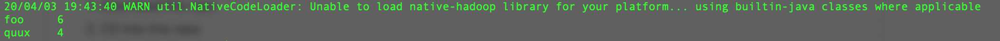
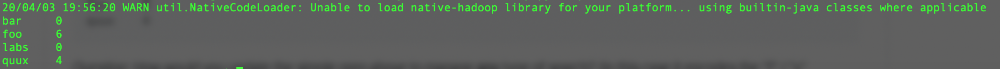
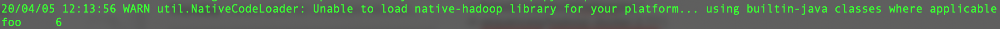

# MapReduce
First Example:
```
sudo docker run \
  -v $(pwd):/usr/local/hadoop/py \
  -it sequenceiq/hadoop-docker:2.7.1 \
  /usr/local/hadoop/py/py_runner.sh grep
```
(notice the **grep** keyword at the end - corresponds to the folder **grep**!)

output:



Second Example:
```
sudo docker run \
  -v $(pwd):/usr/local/hadoop/py \
  -it sequenceiq/hadoop-docker:2.7.1 \
  /usr/local/hadoop/py/py_runner.sh count
```
Outupt:


*Question*: How would you update the simple grep above to manage __any__ type of search? (In this case it encodes the "f" / "x" searching inside the reducer function). So basically, what if I wanted to find all the words that have "oo" or all the words that start in "k" but end in "e" or all the words that have a single capital letter in them?

*Answer*:
To grep anything we want by command, first, I imported a package called” re” in mapping.py to match the pattern we want to search for.  Then I still used the for-loop to split the words and count it. After that, I used an if statement “if re.match(pattern, word)” to print out anything that matches with the pattern we made by argument. Also, I updated the .sh file.

Command 1--all the words that have "oo" :
```
sudo docker run \
  -v $(pwd):/usr/local/hadoop/py \
  -it sequenceiq/hadoop-docker:2.7.1 \
  /usr/local/hadoop/py/py_runner2.sh grep2 foo
```
Output:



Command 2-- all the words that start in "k" but end in "e" :
```
sudo docker run \
  -v $(pwd):/usr/local/hadoop/py \
  -it sequenceiq/hadoop-docker:2.7.1 \
  /usr/local/hadoop/py/py_runner2.sh grep2 ^k$e
```
No output matched

Command 3--all the words that have a single capital letter:
```
sudo docker run \
  -v $(pwd):/usr/local/hadoop/py \
  -it sequenceiq/hadoop-docker:2.7.1 \
  /usr/local/hadoop/py/py_runner2.sh grep2 ^[[:lower:]]*[[:upper:]][[:lower:]]*$
```
No output matched
